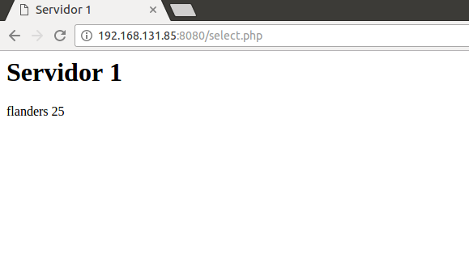

# Primer parcial Distribuidos
## Rodrigo Rivera


### Paso a paso:



##Vagrant file

```ruby

# -*- mode: ruby -*-
# vi: set ft=ruby :

VAGRANTFILE_API_VERSION = "2"

Vagrant.configure(VAGRANTFILE_API_VERSION) do |config|
  config.ssh.insert_key = false

  config.vm.define :centos_balancer do |balancer|
    balancer.vm.box = "centos64"
    balancer.vm.network :private_network, ip: "192.168.133.13"
    balancer.vm.network "public_network", bridge:  "eno1", ip:"192.168.131.85"
    balancer.vm.provider :virtualbox do |vb|
      vb.customize ["modifyvm", :id, "--memory", "1024","--cpus", "1", "--name", "centos_balancer"]
    end
    config.vm.provision :chef_solo do |chef|
      chef.cookbooks_path = "cookbooks"
      chef.add_recipe "balancer"
    end
  end

 

  config.vm.define :centos_web1 do |web|
    web.vm.box = "Centos64Updated"
    web.vm.network :private_network, ip: "192.168.133.10"
    web.vm.network "public_network", bridge:  "eno1", ip:"192.168.131.82"
    web.vm.provider :virtualbox do |vb|
      vb.customize ["modifyvm", :id, "--memory", "1024","--cpus", "1", "--name", "centos-web1" ]
    end
    config.vm.provision :chef_solo do |chef|
      chef.cookbooks_path = "cookbooks"
      chef.add_recipe "web"
      chef.json ={"web" => {"idserver" => "1"}} 
    end
  end

  config.vm.define :centos_web2 do |web|
    web.vm.box = "Centos64Updated"
    web.vm.network :private_network, ip: "192.168.133.11"
    web.vm.network "public_network", bridge:  "eno1", ip:"192.168.131.83"
    web.vm.provider :virtualbox do |vb|
      vb.customize ["modifyvm", :id, "--memory", "1024","--cpus", "1", "--name", "centos-web2" ]
    end
    config.vm.provision :chef_solo do |chef|
      chef.cookbooks_path = "cookbooks"
      chef.add_recipe "web"
      chef.json ={"web" => {"idserver" => "2"}} 
    end
  end

  config.vm.define :centos_db do |db|
    db.vm.box = "Centos64Updated"
    db.vm.network :private_network, ip: "192.168.133.12"
    db.vm.network "public_network", bridge:  "eno1", ip:"192.168.131.84"
    db.vm.provider :virtualbox do |vb|
      vb.customize ["modifyvm", :id, "--memory", "1024","--cpus", "1", "--name", "centos-db" ]
    end
    config.vm.provision :chef_solo do |chef|
      chef.cookbooks_path = "cookbooks"
      chef.add_recipe "db"
    end
  end
 

end
```
