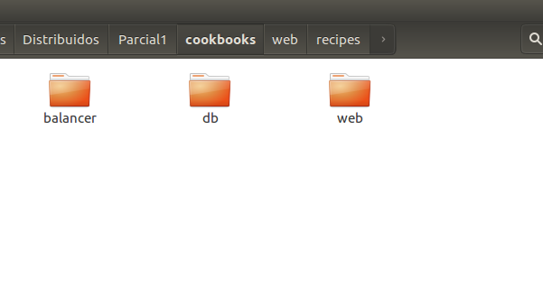
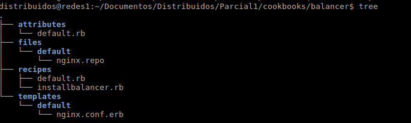
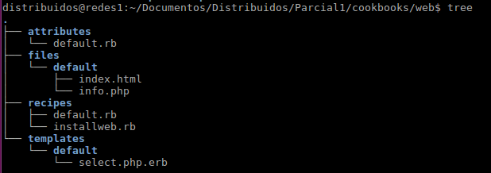
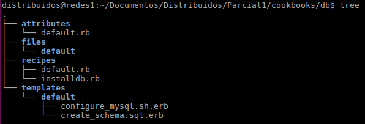

# Primer Parcial Distribuidos
## Rodrigo Rivera


### Paso a paso:


#Aprovisionamiento de máquinas virtuales
Para lograr hacer el aprovisionamiento se debe crear un vagrant file junto con unos cookbooks que representan cada servicio que hace parte de la arquitectura (balanceador de cargas, web, base de datos).
Lo primero que debemos hacer es el vagrant file para aprovisionar cada una de las máquinas como podemos ver a continuación.
##Vagrant file

```ruby

# -*- mode: ruby -*-
# vi: set ft=ruby :

VAGRANTFILE_API_VERSION = "2"

Vagrant.configure(VAGRANTFILE_API_VERSION) do |config|
  config.ssh.insert_key = false

  config.vm.define :centos_balancer do |balancer|
    balancer.vm.box = "centos64"
    balancer.vm.network :private_network, ip: "192.168.133.13"
    balancer.vm.network "public_network", bridge:  "eno1", ip:"192.168.131.85"
    balancer.vm.provider :virtualbox do |vb|
      vb.customize ["modifyvm", :id, "--memory", "1024","--cpus", "1", "--name", "centos_balancer"]
    end
    config.vm.provision :chef_solo do |chef|
      chef.cookbooks_path = "cookbooks"
      chef.add_recipe "balancer"
    end
  end

 

  config.vm.define :centos_web1 do |web|
    web.vm.box = "Centos64Updated"
    web.vm.network :private_network, ip: "192.168.133.10"
    web.vm.network "public_network", bridge:  "eno1", ip:"192.168.131.82"
    web.vm.provider :virtualbox do |vb|
      vb.customize ["modifyvm", :id, "--memory", "1024","--cpus", "1", "--name", "centos-web1" ]
    end
    config.vm.provision :chef_solo do |chef|
      chef.cookbooks_path = "cookbooks"
      chef.add_recipe "web"
      chef.json ={"web" => {"idserver" => "1"}} 
    end
  end

  config.vm.define :centos_web2 do |web|
    web.vm.box = "Centos64Updated"
    web.vm.network :private_network, ip: "192.168.133.11"
    web.vm.network "public_network", bridge:  "eno1", ip:"192.168.131.83"
    web.vm.provider :virtualbox do |vb|
      vb.customize ["modifyvm", :id, "--memory", "1024","--cpus", "1", "--name", "centos-web2" ]
    end
    config.vm.provision :chef_solo do |chef|
      chef.cookbooks_path = "cookbooks"
      chef.add_recipe "web"
      chef.json ={"web" => {"idserver" => "2"}} 
    end
  end

  config.vm.define :centos_db do |db|
    db.vm.box = "Centos64Updated"
    db.vm.network :private_network, ip: "192.168.133.12"
    db.vm.network "public_network", bridge:  "eno1", ip:"192.168.131.84"
    db.vm.provider :virtualbox do |vb|
      vb.customize ["modifyvm", :id, "--memory", "1024","--cpus", "1", "--name", "centos-db" ]
    end
    config.vm.provision :chef_solo do |chef|
      chef.cookbooks_path = "cookbooks"
      chef.add_recipe "db"
    end
  end
 

end
```

Podemos apreciar como se define el nombre de la base de datos en cada caso (para base de datos db= centos_db) en la cual se crea una máquina con el box Centos64Updated y se especifica la dirección ip de la máquina junto con la dirección e interfaz con la cual se hará puente para poder tener salida a la red del laboratorio (pool de direcciones asignada en clase) y se customiza con cada parámetro (recursos de la máquina) necesario. Luego se especifica en cada segmento la herramienta de aprovisionamiento que se usará, en este caso, chef, además de la ruta en la cual se encuentra el cookbook respectivo para dicha máquina junto con las carpetas básicas (attributes, files, recipes, templates) y receta para que se implemente el servicio deseado.

##Cookbooks
Aqui podemos apreciar los cookbooks necesarios para el aprovisionamiento de las máquinas con base en la arquitectura propuesta.


###Balancer


####default.rb
```
default[:balancer][:maqa]='192.168.131.82'
default[:balancer][:maqb]='192.168.131.83'
```
####nginx.repo
```
[nginx]
name=nginx repo
baseurl=http://nginx.org/packages/centos/$releasever/$basearch/
gpgcheck=0
enabled=1
```
####installbalancer.rb
```ruby
bash 'open port' do
   code <<-EOH
   iptables -I INPUT 5 -p tcp -m state --state NEW -m tcp --dport 8080 -j ACCEPT
   iptables -I INPUT 5 -p tcp -m state --state NEW -m tcp --dport 80 -j ACCEPT
   service iptables save
   EOH
end

cookbook_file '/etc/yum.repos.d/nginx.repo' do
   source 'nginx.repo'
   mode 0777
end

package 'nginx'

template '/etc/nginx/nginx.conf' do
   source 'nginx.conf.erb'
   mode 0777
   variables(
      maqa: node[:balancer][:maqa],
      maqb: node[:balancer][:maqb]
   )
end

service 'nginx' do
   action [:enable, :start]
end
```
####nginx.conf.erb
```ruby
worker_processes  1;
events {
   worker_connections 1024;
}
http {
    upstream servers {
         server <%=@maqa%>;
         server <%=@maqb%>;
    }
    server {
        listen 8080;
        location / {
              proxy_pass http://servers;
        }
    }
}
```
###Web


####default.rb
```
default[:web][:ipdb]='192.168.131.84'
default[:web][:usuario]='icesi'
default[:web][:pass]='12345'
```

####installweb.rb
```ruby
package 'httpd'

package 'php'

package 'php-mysql'

package 'mysql'

service 'httpd' do
  action [:enable, :start]
end

bash 'open port' do
  code <<-EOH
  iptables -I INPUT 5 -p tcp -m state --state NEW -m tcp --dport 80 -j ACCEPT
  service iptables save
  EOH
end

cookbook_file '/var/www/html/info.php' do
  source 'info.php'
  mode 0644
end

template '/var/www/html/select.php' do
  source 'select.php.erb'
  mode 0777
  variables(
     idserver:node[:web][:idserver],
     pass: node[:web][:pass],
     ipdb: node[:web][:ipdb],
     usuario: node[:web][:usuario]
)
end
```

####select.php.erb
```html
<HTML>
	<HEAD>
	<TITLE>Servidor <%=@idserver%></TITLE>
	</HEAD>
<BODY>
<H1>Servidor <%=@idserver%></H1>

<?php
$con = mysql_connect("<%=@ipdb%>","<%=@usuario%>","<%=@pass%>");
if (!$con)
  {
  die('Could not connect: ' . mysql_error());
  }
mysql_select_db("database1", $con);
$result = mysql_query("SELECT * FROM example");
while($row = mysql_fetch_array($result))
  {
  echo $row['name'] . " " . $row['age'];
  echo "<br />";
  }
mysql_close($con);
?>
```

###Base de datos


####default.rb
```
default[:db][:password]='distribuidos'
default[:db][:ipserv1]='192.168.131.82'
default[:db][:ipserv2]='192.168.131.83'
default[:db][:id]='12345'
default[:db][:user]='icesi'
```

####installdb.rb
```ruby
package 'mysql-server'
package 'expect'
service 'mysqld' do
  action [:enable, :start]
end

bash 'open port' do
  code <<-EOH
  iptables -I INPUT 5 -p tcp -m state --state NEW -m tcp --dport 3306 -j ACCEPT
  service iptables save
  EOH
end

template '/tmp/configure_mysql.sh' do
  source 'configure_mysql.sh.erb'
  mode 0777
  variables(
	password: node[:db][:password]
)
end
template '/tmp/create_schema.sql' do
  source 'create_schema.sql.erb'
  mode 0777
  variables(
	ipserv1: node[:db][:ipserv1],
	ipserv2: node[:db][:ipserv2],
	user: node[:db][:user],
	id: node[:db][:id]
)
end

bash 'configure mysql' do
  cwd '/tmp'
  code <<-EOH
  ./configure_mysql.sh
  EOH
end

bash 'create schema' do
	user 'root'
	cwd '/tmp'
	code <<-EOH
	cat create_schema.sql | mysql -u root -pdistribuidos
	EOH
end
```

####create_schema.sql.erb
```
CREATE database database1;
USE database1;
CREATE TABLE example(
id INT NOT NULL AUTO_INCREMENT, 
PRIMARY KEY(id),
 name VARCHAR(30), 
 age INT);
INSERT INTO example (name,age) VALUES ('flanders',25);
-- http://www.linuxhomenetworking.com/wiki/index.php/Quick_HOWTO_:_Ch34_:_Basic_MySQL_Configuration
GRANT ALL PRIVILEGES ON *.* to '<%=@user%>'@'<%=@ipserv1%>' IDENTIFIED by '<%=@id%>';
GRANT ALL PRIVILEGES ON *.* to '<%=@user%>'@'<%=@ipserv2%>' IDENTIFIED by '<%=@id%>';
```


